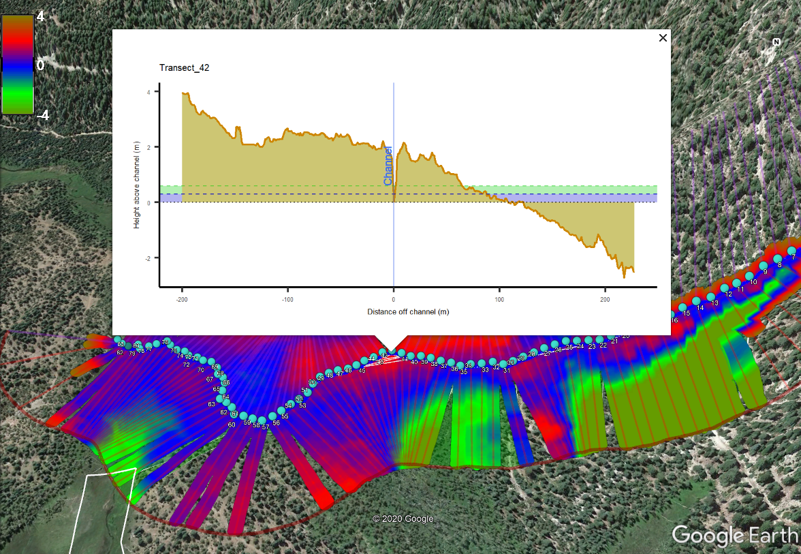

## ProcessSpace

#### Adam Cummings (USFS), <adam.cummings@usda.gov>

A package to process Lidar to visualize stream channels flow paths.

### Description

This process space tool automates a detailed catchment-level assessment of
streams and channels using LiDAR-derived DEMs to enable visualization of flow
path anomalies and restoration opportunities not easily observed in the field or
using conventional maps. From steep tributaries to the valley bottom, flow paths
can be assessed to determine if they were degraded, ditched, or if flow paths
had been redirected or constricted due to current or historical roads or other
disturbances. This information can be used to restore natural flow paths with
high precision interventions to restore stream function, reduce need for road
and culvert repair, and restore downstream valley-bottom habitats.

Outputs include topographical cross-sections, 1-ft and 2-ft process space
polygons that estimate increases to baseline surface water levels at time of
LiDAR and color-coded detrended elevation models all of which can be visualized
three-dimensionally in Google Earth using the kmz file output.


### Installation

Install the package as follows:

``` r
install.packages('devtools')
library(devtools)
install_github('adamkc/ProcessSpace')
library(ProcessSpace)
```

This package requires a few spatial packages that themselves have many requirements. This installation process doesn't always go smoothly/perfectly. It may try to update 30-50 packages and throw an error along the way..  **`ProcessSpace`** requires the following packages (with versions updated since 2020, roughly.) If you hit issues, consider just installing these packages first, slowly, one at a time, and then retrying installing `ProcessSpace`.

``` r
  install.packages("dplyr")
  install.packages("tidyr")
  install.packages("purrr")
  install.packages("ggplot2")
  install.packages("cowplot")
  install.packages("magrittr")
  install.packages("ggmap")
  install.packages("sf")
  install.packages("plotKML")
  install.packages("raster")
  install.packages("concaveman")
  install.packages("crayon")
  install.packages("gstat")
  install.packages("smoothr")
  install.packages("units")
  install.packages("zip")
```

### Inputs

1. Digital Terrain Model
2. Target Stream Reach

### Outputs

1. Algorithmic cross sections
1. Process Space delineation
1. Report export
1. Detrended elevations
1. A mindset that extends beyond the meadow surface

### Example Code:

The example below will produce a KMZ file to load into Google Earth.

``` r
library(ProcessSpace)
library(ggmap) # necessary to load google credentials for sat imagery. Not required.

#Filepath to raster DEM (change to your own file):
rasterLocation <- system.file("external/raster.tif", package="ProcessSpace") 
#Filepath to stream shapefile (change to your own file):
streamLocation <- system.file("external/streams.shp", package="ProcessSpace") 
streams <- sf::read_sf(streamLocation)
#Pick a target stream for analysis: (`LINKNO` is the FID in this shapefile)
targetStream <- streams %>% dplyr::filter(LINKNO %in% c(12,20))


targetStream %>%
  generateCrossSections(xSectionDensity = units::as_units(100,"m"), # How often cross sections are taken.
                        googleZoom=16,                              # Pick appropiate Google zoom level.
                        xSectionLength = units::as_units(100,"m"),  # How far from channel to extend cross sections.
                        cut1Dir = "W") %>%                          # cut1Dir: cardinal direction of upstream point of targetstream
  allAtOnce(outputFilename = "exampleOutput.pdf",
            rasterDir = rasterLocation,
            streamDir = streamLocation,
            returnObject = FALSE,
            doExportSpatial = TRUE)
```


