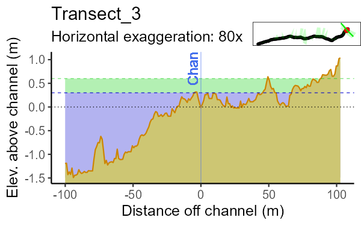

# Load the required packages:

```{r setup}
knitr::opts_chunk$set(echo = TRUE)
knitr::opts_chunk$set(message = FALSE)
knitr::opts_chunk$set(error = FALSE)
knitr::opts_chunk$set(warning = FALSE)
library(ProcessSpace)
library(ggmap)
library(raster)
```

# load the Data files and check them

```{r}
rasterDir <- system.file("external/raster.tif", package="ProcessSpace")
streamsDir <- system.file("external/streams.shp", package="ProcessSpace")
r <- raster(rasterDir)
streams <- sf::read_sf(streamsDir)

s <- raster::terrain(r, opt="slope")
a <- raster::terrain(r, opt="aspect")
h <- raster::hillShade(s,a)
h %>% rasterToPoints() %>% data.frame() %>% 
  ggplot() + geom_tile(aes(x=x,y=y,fill=layer),show.legend = FALSE) + geom_sf(data=streams) +
  geom_sf_label(data=streams,aes(label=LINKNO),size=3,
                label.padding=unit(.1,"lines")) +
  scale_fill_viridis_c() + theme_minimal()

# s %>% rasterToPoints() %>% data.frame() %>% 
#   ggplot() + geom_tile(aes(x=x,y=y,fill=slope),show.legend = FALSE) + geom_sf(data=streams) +
#   geom_sf_label(data=streams,aes(label=LINKNO),size=3,
#                 label.padding=unit(.1,"lines")) +
#   scale_fill_viridis_c() + theme_minimal()


```

We like the look of stream segments *12* and *20* for further investigation.
Let's pull those two aside and confirm we grabbed the right ones:

```{r,fig.height=2.5,fig.width=4}
targetStream <- streams %>% dplyr::filter(LINKNO %in% c(12,20))
#Check that you grabbed the right streams:
ggplot(streams) + geom_sf() +
  geom_sf(data=targetStream,col="blue4",size=3,alpha=.6) +
  theme_nothing()

```

# Lets run it through the tool!

## First, generate the cross sections:

This places evenly spaced points along the selected stream file at the interval
selected. Then it draws semi-permendicular cross sections at each point at for the length given. You need to indicate the general flow direction of the stream with cut1Dir and cut2Dir.  If the stream flows West to East provide "W" and "E", if it flows North to East provide "N", "E"

```{r}
transectObject <- targetStream %>%
  generateCrossSections(xSectionDensity = units::as_units(20,"m"),
                        googleZoom=16,
                        xSectionLength = units::as_units(100,"m"),
                        cut1Dir = "W",
                        cut2Dir = "E")

transectObject$satImage %>% ggmap() +
  geom_sf(data=transectObject$mainLine %>% sf::st_transform(4326), 
          col="blue4",alpha=.5,size=2,inherit.aes = FALSE) +
  geom_sf(data=transectObject$ls0 %>% sf::st_transform(4326),
          inherit.aes = FALSE) + 
  geom_sf(data=transectObject$rs0 %>% sf::st_transform(4326),
          col="blue",inherit.aes = FALSE) +    
  geom_sf(data=transectObject$leftSide %>% sf::st_transform(4326),inherit.aes = FALSE) + 
  geom_sf(data=transectObject$rightSide %>% sf::st_transform(4326),
          col="blue",inherit.aes = FALSE)
```

## Second, run it through a series of manipulations:

```{r}
# transectObject <- transectObject %>%
#   addTopoLines(rasterDir = rasterDir) %>%
#   addStreamChannels(rasterDir = rasterDir,streamChannelFile = streamsDir) %>%
#   addCrossSectionElevations(rasterDir = rasterDir) %>%
#   addProcessSpace() %>%
#   buildXSectionPlot(plotFileName = "exampleOutput.pdf",streamChannelFile = streamsDir) %>%
#   rasterPlotter(rasterDir = rasterDir)


transectObject <- transectObject %>% allAtOnce(outputFilename = "exampleOutput.pdf",
                             rasterDir = rasterDir,
                             verticalCutoff=8,
                             streamChannelFile = streamsDir,
                             returnObject = TRUE,
                             doExportSpatial = FALSE)
```

## Then export the results as a comprehensive KMZ file:

This produces a KMZ file that contains the cross section plots imbedded.  Clicking the points along the stream file pull up the cross section plots

```{r}
exportSpatials(transectObject,sectionName = "exampleOutput")
```

## Here's what the detrended raster and a single cross section plot can look like:

Regions of the map with lower elevations than the stream are green, regions
similar in elevation to the stream are blue, and regions higher than the stream
elevation go from red to tan.


Cross section look like this: They are plotted as though you're looking upstream
(which comes naturally when then raster and cross sections are viewed 3D in
google earth.) The blue and green bands show elevations within 1ft and 2ft of
the stream channel. This particular transect shows the stream is captured by a
highly incised channel and the terrain slopes downhill in either perpendicular
direction from the stream path. Perhaps this is not a natural flow path?


